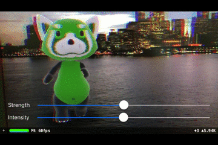

# ARComicFX

Reproduce Spider Varse-like color shift (Fringe/Off-registration) with ARKit.



  

#### Set parameters (sceneView = SCNView)

```
let mainCamera = sceneView.pointOfView?.camera

mainCamera?.colorFringeStrength = 5
mainCamera?.colorFringeIntensity = 0.5
```
